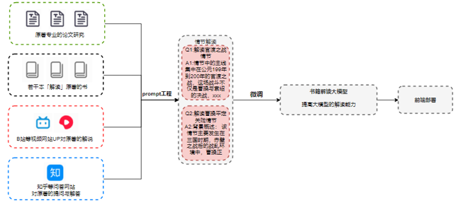
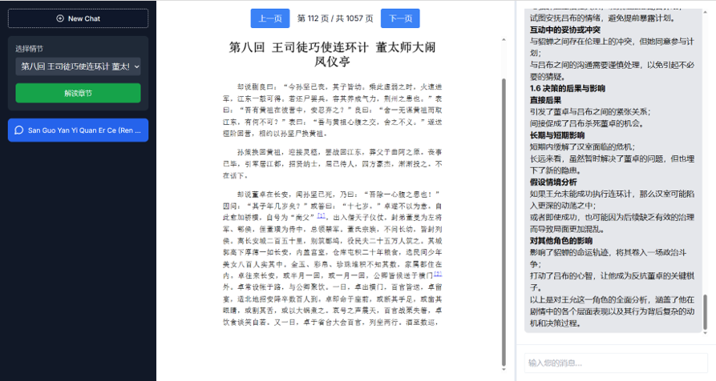

# InspireReads
**InspireReads**一款能够解读书籍的大模型应用
* 情节解读：该应用能够精准解析书籍中的情节结构，提炼关键情节点，并揭示故事背后的潜在主题和作者的思想脉络。
* 情节对话：该应用具备智能情节对话功能，能够与用户进行互动，基于书籍内容生成多种情境对话，帮助用户更全面地理解人物动机、情节发展及其内在逻辑。

## 一、环境准备

安装依赖
```
npm i
```
运行代码
```
npm run dev
```
## 二、数据准备以及模型微调
从各种渠道收集与书籍内容相关的解读数据，通过特征工程从原始解读数据中提取关键信息，作为数据集，并对大模型进行微调，使其能够更好地理解书籍内容。


特征工程所用到的提示词如下：
```
情节概述：
简要描述情节发生的背景、主要事件及其发展过程。
概述情节中的主要利益冲突、背景设定和外部压力等因素。
分析这些因素如何影响角色的决策和行动。
逐角色深入分析

对于每个主要角色，按照以下结构进行系统、连贯且深入的分析：
对于决策方面的分析，应该非常详细才行！！！不放过任何一个细节！！！
角色分析模板
角色名称： [角色A]

1. 角色背景与定位

背景介绍：
角色的历史、地位、性格特点等。
角色在情节中的定位及其重要性。
2. 核心问题与目标

核心问题：
角色在当前情节中面临的最关键问题是什么？
这些问题如何相互交织，影响角色的决策？
目标：
明确角色的短期和长期目标。
这些目标是战略性的还是应急性的？
3. 动机与驱动因素

动机：
角色的决策背后的心理驱动力，如权力欲、忠诚、个人情感、恐惧、利益等。
这些动机如何具体影响角色的行为和选择？
内在驱动：
角色的个人价值观、信念体系如何引导其决策？
角色的情感状态（如压力、焦虑、决心）如何影响其选择？
4. 决策过程与选择
对于决策方面的分析，应该非常详细才行！！！不放过任何一个细节！！！你需要做到决策以情节为基础进行分析！！！绝对不是空话分析！
决策过程：
描述角色在复杂环境下的决策过程，包括信息收集、分析和评估。
角色在做出决策时所采用的思维方式（如理性分析、直觉判断）。
具体选择：
列出角色面临的具体选择，每个选择的详细描述。
选择理由：
深入解释角色为何选择某一措施，详细探讨其背后的原因。
结合角色的目标、动机和外部环境，说明选择的逻辑和合理性。
替代方案分析：
分析角色可能的替代方案，讨论每个方案的优缺点。
解释为何角色最终放弃其他选项，选择特定的路径。
权衡与妥协：
探讨角色在决策过程中如何权衡不同因素（如短期与长期利益、个人与集体利益）。
分析角色是否在某些方面做出了妥协，及其原因。
5. 决策的执行与互动

执行过程：
描述角色如何将决策付诸实践，具体采取了哪些措施。
分析执行过程中遇到的困难、阻力及必要的调整。
人物互动：
描述角色与其他人物之间的互动方式，如合作、对抗、背叛等。
分析这些互动如何影响角色的决策和执行过程。
探讨互动中的妥协或冲突对角色最终决策的影响。
6. 决策的后果与影响

直接后果：
角色决策执行后的直接结果，是否实现了其初衷和目标。
长期与短期影响：
分析这些后果在短期和长期内对角色及整个情节的影响。
探讨角色是否因过度关注眼前利益而忽视了长远目标，或反之。
假设情境分析：
讨论如果角色选择了其他路径，情节可能会如何发展，带来哪些不同的结果。
对其他角色的影响：
分析该角色的决策是否对其他人物或整体局势产生了连锁反应。
讨论某一角色的成功或失败决策如何影响他人的命运，或引发对手的反应，进而改变整个情节走向。
7. 综合总结

决策合理性：
评估角色决策的合理性及其背后的逻辑。
一致性与矛盾：
分析角色的行为是否与其目标和动机一致，是否存在内在矛盾或自相矛盾之处。
推动情节发展：
讨论角色的决策如何推动整个情节的发展。
总结与引导性问题

总体总结：
对所有角色的分析进行综合总结，展示各角色决策之间的关联及其对情节的整体影响。
引导性问题：
这些问题旨在进一步深化分析，帮助读者思考和理解角色的决策过程。例如：
各角色的决策是否存在相互影响或制约？
角色之间的互动如何共同推动情节发展？
是否有其他潜在的决策路径未被探索，这些路径可能带来哪些不同的结果？
角色在决策过程中是否有未被充分利用的资源或信息？
角色的情感状态在多大程度上影响了其决策？


解读内容如下

```
## 三、运行截图
执行完`npm run dev`之后，打开localhost:3000，即可看到项目首页

在首页拖入`三国演义.pdf`即可进入到书籍解读页面

